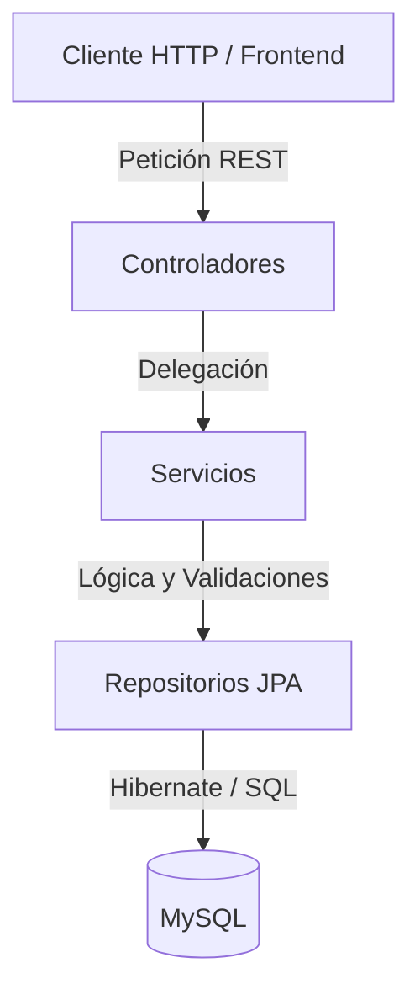

# Proyecto-CineDesarrollo-Back

API REST para la gestión de un sistema de cine, incluyendo administración de clientes, películas, salas y compras.

---

## Resumen técnico

| Componente     | Tecnología / Detalle |
| -------------- | -------------------- |
| **Backend**    | Java 17, Spring Boot 3.4.3, Maven |
| **Frontend**   | No aplica (API REST) |
| **Base de datos** | MySQL |
| **ORM**        | Hibernate (Spring Data JPA) |
| **Autenticación** | Login personalizado con encriptación BCrypt |
| **Despliegue** | Local |

---

## Características

* Gestión de usuarios (registro y autenticación de clientes).
* Gestión de películas en cartelera.
* Administración de salas y disposición de sillas.
* Sistema de compras con carrito (tickets y combos de comida).
* Facturación vinculada a cada cliente.
* Documentación de la API integrada y autogenerada mediante Swagger (OpenAPI 3).

---

## Arquitectura

El backend implementa una arquitectura multicapa basada en los estándares de Spring Boot:



* **Controllers**: Exponen los endpoints REST y manejan las peticiones HTTP del cliente.
* **Services**: Contienen la lógica de negocio y las reglas de validación.
* **Repositories**: Interfaces que abstraen las operaciones de la base de datos usando Spring Data JPA.
* **Models**: Entidades mapeadas directamente a las tablas de la base de datos MySQL.

---

## Flujo de la aplicación

1. El cliente realiza una petición HTTP a un endpoint expuesto por un **Controller** (ej. `/api/clientes`).
2. El **Controller** procesa los parámetros o el cuerpo de la petición y delega la ejecución al **Service** correspondiente.
3. El **Service** ejecuta las validaciones y la lógica de negocio requerida.
4. El **Service** invoca al **Repository** para consultar o modificar datos.
5. El **Repository**, a través de Hibernate, traduce la operación a una consulta SQL y la ejecuta en MySQL.
6. La base de datos retorna el resultado, que viaja de regreso por las capas hasta el **Controller**, donde se emite una respuesta HTTP en formato JSON.

---

## Tecnologías utilizadas

* Java 17
* Spring Boot (Web, Data JPA, Security)
* MySQL Connector/J
* Lombok
* Springdoc OpenAPI (Swagger UI)
* Maven

---

## Módulos principales

* **Clientes**: Registro, inicio de sesión seguro, actualización de perfil y consulta de facturas.
* **Películas**: Consulta de detalles de las películas disponibles.
* **Salas**: Gestión de las salas de cine y estado de las sillas (disponibles/ocupadas).
* **Carrito y Combos**: Administración de los productos seleccionados para compra (comida y entradas).

---

## Buenas prácticas implementadas

* Separación por capas (Controllers, Services, Repositories, Models).
* Repository Pattern a través de Spring Data JPA.
* Inyección de dependencias mediante constructor (`@Autowired`).
* Documentación de código de API RESTful con anotaciones OpenAPI (`@Operation`, `@ApiResponse`).
* Políticas de CORS habilitadas (`@CrossOrigin(origins = "*")`).

---

## Estructura del proyecto

```text
src/main/java/com/example/demo/
├── Exception/
├── model/           # Entidades JPA (Bill, Client, Hall, Movie, Ticket, etc.)
├── repositorios/    # Interfaces de Spring Data (RepositoryClient, etc.)
├── servicios/       # Lógica de negocio (ServiceClient, etc.)
├── Controller*.java # Controladores REST
├── DemoApplication.java
└── SecurityConfig.java
src/main/resources/
└── application.properties
```

---

## Requisitos previos

* **Java Development Kit (JDK)** 17 o superior.
* **Maven**.
* **MySQL Server** en ejecución.

---

## Instalación

1. Clona el repositorio en tu máquina local.
2. Navega al directorio del proyecto:
   ```bash
   cd Proyecto-CineDesarrollo-Back
   ```
3. Descarga las dependencias utilizando Maven:
   ```bash
   mvn clean install -DskipTests
   ```

---

## Ejecución

Para iniciar el servidor localmente, utiliza el siguiente comando:

```bash
mvn spring-boot:run
```

La API estará disponible en `http://localhost:8080`.
Para explorar la documentación de la API interactiva, ingresa a `http://localhost:8080/swagger-ui/index.html` (o la ruta por defecto de Springdoc en tu entorno).
